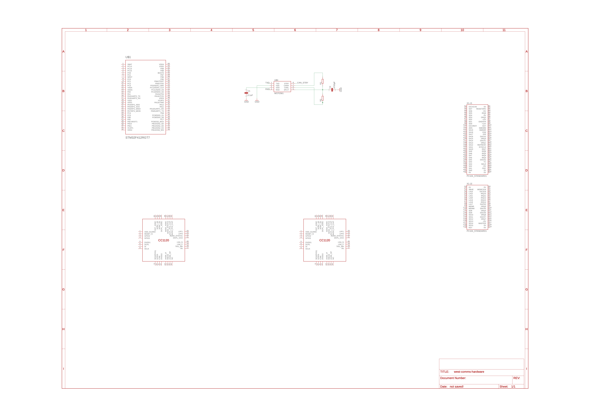

# WEST Communications Hardware

## Goal
The following PCB will contain all the necessary electronics the satellite will need in order to communicate with the groundstation over UHF (uplink) and VHF (downlink). The system consists of two transceivers which allow for full-duplex communication. 

## Design
Below are screenshots of the current revision of the schematic (created in Eagle). Many of the parts have tentative selections but are subject to change.

### Schematic

## Features
#### Microcontroller
[STM32F412](https://www.st.com/resource/en/datasheet/stm32f412ce.pdf)

#### RF Transceiver
[CC1120](https://www.ti.com/lit/ds/symlink/cc1120.pdf?ts=1611196218895&ref_url=https%253A%252F%252Fwww.ti.com%252Fproduct%252FCC1120)

#### CAN Transceiver
[MCP2561](https://ww1.microchip.com/downloads/en/DeviceDoc/20005167C.pdf)

#### BUS
[PC/104](https://pc104.org/wp-content/uploads/2015/02/PC104_Spec_v2_6.pdf)

## Progress
- [] Select microcontroller
- [] Select RF transceiver
- [] Select CAN transceiver
- [] Create schematic
- [] Layout board
- [] Route board
- [] Order board
- [] Test board